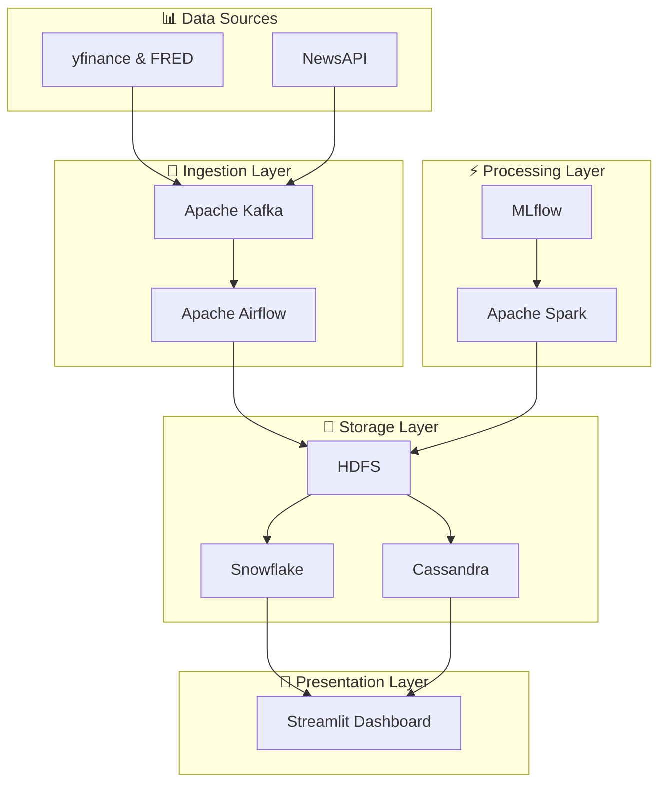

# 🏆 Documentation du Projet Gold Price Analytics

<div align="center">
  
  
  
  
  

</div>

---

## 🌟 Introduction

> **Gold Price Analytics** est une plateforme complète conçue pour analyser les données du marché de l'or, en intégrant des données financières, des actualités et des analyses prédictives.

Cette solution utilise une **architecture moderne** basée sur des technologies Big Data et d'intelligence artificielle pour fournir des insights techniques, fondamentaux et interactifs via une interface utilisateur intuitive. Le projet est structuré pour gérer l'ingestion, le traitement, l'analyse et la visualisation des données, avec un déploiement orchestré via Docker.

---

## 📚 Table des Matières

<details>
<summary>🔍 Cliquez pour voir la table des matières détaillée</summary>

1. [🎯 Objectifs du Projet](#-objectifs-du-projet)
2. [🏗️ Architecture du Projet](#️-architecture-du-projet)
3. [📁 Structure des Dossiers et Fichiers](#-structure-des-dossiers-et-fichiers)
4. [🛠️ Technologies Utilisées](#️-technologies-utilisées)
5. [⚙️ Configuration et Déploiement](#️-configuration-et-déploiement)
6. [🔄 Pipeline de Données](#-pipeline-de-données)
7. [🤖 Modèles d'Analyse](#-modèles-danalyse)
8. [📊 Tableau de Bord Streamlit](#-tableau-de-bord-streamlit)
9. [👁️ Surveillance et Logging](#️-surveillance-et-logging)
10. [📥 Instructions d'Installation](#-instructions-dinstallation)
11. [🚀 Utilisation](#-utilisation)
12. [🤝 Contributions et Maintenance](#-contributions-et-maintenance)

</details>

---

## 🎯 Objectifs du Projet

<div align="center">
  
| 🎯 **Objectif** | 📋 **Description** |
|:---|:---|
| **📈 Analyser les données du marché de l'or** | Collecter et traiter les données historiques et en temps réel sur les prix de l'or, les indices S&P 500, les taux d'intérêt fédéraux et les actualités pertinentes |
| **🔍 Fournir des insights techniques et fondamentaux** | Offrir des analyses basées sur des indicateurs techniques (moyennes mobiles, variations de prix) et des analyses fondamentales via l'intégration d'actualités |
| **🔮 Prédire les tendances** | Utiliser des modèles d'apprentissage automatique pour anticiper les mouvements des prix de l'or |
| **💬 Interagir avec les utilisateurs** | Proposer une interface utilisateur interactive via Streamlit et un module de chat AI basé sur Gemini pour répondre aux questions des utilisateurs |

</div>

---

## 🏗️ Architecture du Projet



L'architecture est **modulaire** et basée sur des conteneurs Docker, orchestrés par `docker-compose.yml`. Elle comprend :

### 🔽 **1. Ingestion des Données**
- **📊 Sources** : Données financières via yfinance et FRED, actualités via NewsAPI
- **🛠️ Outils** : Apache Kafka pour le streaming, Airflow pour l'orchestration des tâches

### 💾 **2. Stockage**
- **🗃️ HDFS** : Stockage des données brutes et traitées au format CSV et Parquet
- **❄️ Snowflake** : Base de données analytique pour les tables dimensionnelles et factuelles
- **🔗 Cassandra** : Stockage des actualités et des analyses d'impact

### ⚡ **3. Traitement**
- **✨ Spark** : Traitement des flux de données et analyse des actualités
- **🤖 MLflow** : Gestion des modèles d'apprentissage automatique

### 📊 **4. Visualisation**
- **🎨 Streamlit** : Tableau de bord interactif pour l'analyse technique, fondamentale et le chat AI

### 👁️ **5. Surveillance**
- Airflow pour le monitoring des pipelines
- Discord pour les alertes en cas d'erreurs dans les logs Spark

---

## 📁 Structure des Dossiers et Fichiers

<details>
<summary>🌳 Arborescence complète du projet</summary>

```
📦 C:\Users\Youcode\Documents\gold_price_project
├── 📄 .gitignore
├── 📄 data.sql.txt
├── 🐳 docker-compose.yml
├── 🐍 test.py
├── 🐍 x.py
├── 📂 airflow/
│   ├── 📄 requirements.txt
│   └── 📂 dags/
│       ├── 🐍 extract_gold.py
│       ├── 🐍 load.py
│       ├── 🐍 monitor_spark.py
│       ├── 🐍 news_batch.py
│       ├── 🐍 stream.py
│       ├── 🐍 while.py
│       └── 🐍 gold_trading_dashboard.py
├── 📂 docker/
│   ├── 🐳 agent.dockerfile
│   ├── 🐳 ai_trainer.dockerfile
│   ├── 🐳 apache.dockerfile
│   ├── 🐳 hadoop.dockerfile
│   └── 📄 requirements.txt
├── 🔐 keys/
├── 📂 ML/
│   ├── 📄 commande.sh
│   ├── 🐳 Dockerfile
│   ├── 🐍 fine_tune_model.py
│   ├── 📄 mlflow.db
│   ├── 📄 requirements.txt
│   └── 🐍 train_model.py
├── 📂 ollama_llm/
│   ├── 🐳 Dockerfile
│   └── 📄 entrypoint.sh
├── 📂 postgres/
│   └── 📄 init.sql
├── 📂 scripts/
│   ├── 📂 batch/
│   └── 📂 mapreduce/
└── 📂 stream/
    ├── 📂 cassandra/
    │   ├── 📄 cassandra-rackdc.properties
    │   ├── 📄 cassandra-setup.cql
    │   ├── 📄 cassandra.yaml
    │   └── 🐳 Dockerfile
    ├── 📂 kafka/
    │   ├── 🐳 Dockerfile
    │   ├── 📄 kafka-setup-k8s.sh
    │   ├── 📄 kafka.properties
    │   ├── 📄 requirements.txt
    │   └── 📂 scripts/
    │       ├── 🐍 gold_price.py
    │       ├── 🐍 news_producer.py
    │       └── 📂 logs/
    │           └── 📄 kafka.log
    └── 📂 spark/
        ├── 🐍 analyze_news.py
        ├── 📄 commande.sh
        ├── 🐳 Dockerfile
        ├── 🐍 gold_price_streaming.py
        ├── 📄 requirements.txt
        ├── 🐍 spark_consume_test.py
        ├── 🐍 store_news_to_hdfs.py
        └── 📂 logs/
            └── 📄 spark.log
```

</details>

### 🔍 Description des Fichiers Principaux

<div align="center">

| 📄 **Fichier** | 📋 **Description** |
|:---|:---|
| **📄 .gitignore** | Ignore les environnements virtuels (`myenv`) et les artifacts MLflow (`ML/mlruns`) |
| **📄 data.sql.txt** | Définit le schéma Snowflake pour les tables `Dim_Date`, `Dim_Marche`, et `Fait_Prix_Or` |
| **🐳 docker-compose.yml** | Configure les services Docker (Airflow, HDFS, Kafka, Spark, MLflow, Cassandra, Streamlit, etc.) |
| **🐍 test.py** | Script pour télécharger et lire les fichiers CSV/Parquet depuis HDFS, avec prévisualisation des données |
| **🐍 x.py** | Script utilitaire pour générer la structure du projet et gérer les interactions avec HDFS |

</div>

#### 🔄 **airflow/dags/** - Orchestration des tâches

| 🐍 **Script** | 🎯 **Fonction** |
|:---|:---|
| **extract_gold.py** | Extrait les données de l'or, S&P 500, et taux fédéraux via yfinance et FRED |
| **load.py** | Charge les données traitées dans Snowflake avec des opérations MERGE pour éviter les doublons |
| **monitor_spark.py** | Surveille les logs Spark pour détecter les erreurs et envoie des alertes via Discord |
| **news_batch.py** | Ingère les actualités via NewsAPI et les stocke dans HDFS |
| **gold_trading_dashboard.py** | Tableau de bord Streamlit pour l'analyse technique, fondamentale et le chat AI |

#### 🤖 **ML/** - Machine Learning

| 🐍 **Script** | 🎯 **Fonction** |
|:---|:---|
| **train_model.py** | Entraîne un modèle de régression linéaire pour prédire les prix de l'or |
| **fine_tune_model.py** | Fine-tune un modèle existant avec de nouvelles données mensuelles |

#### 🔄 **stream/** - Traitement en temps réel

| 📂 **Module** | 🎯 **Fonction** |
|:---|:---|
| **kafka/** | Configure Kafka pour le streaming des données de prix et d'actualités |
| **spark/** | Traite les flux de données et analyse les actualités avec Spark |
| **cassandra/** | Stocke les actualités et leurs analyses d'impact |

#### 🤖 **ollama_llm/** - IA Conversationnelle
Configuration pour le modèle Mistral (commenté dans `docker-compose.yml`)

---

## 🛠️ Technologies Utilisées

<div align="center">

### 🔄 **Ingestion et Orchestration**


### 💾 **Stockage**


### ⚡ **Traitement**


### 📊 **Visualisation**


### 🤖 **IA et Analyse**


### 🐳 **Conteneurisation**


</div>

---

## ⚙️ Configuration et Déploiement

### 📋 Pré-requis

<div align="center">

| ✅ **Requis** | 📋 **Description** |
|:---|:---|
| 🐳 **Docker & Docker Compose** | Installés et configurés |
| ❄️ **Compte Snowflake** | Identifiants configurés dans `load.py` et `gold_trading_dashboard.py` |
| 📰 **Clé API NewsAPI** | Pour `news_batch.py` et `news_producer.py` |
| 🤖 **Clé API Gemini** | Pour `gold_trading_dashboard.py` et `analyze_news.py` |
| 🏦 **Clé FRED** | Pour `extract_gold.py` |

</div>

### 🔧 Configuration

#### 🔑 **1. Clés API**
Configurez les clés API dans les fichiers respectifs :

```python
# 📊 Dans extract_gold.py
ALPHA_VANTAGE_KEY = "votre_clé_alpha_vantage"
FRED_KEY = "votre_clé_fred"

# 📰 Dans news_batch.py et news_producer.py
API_KEY = "votre_clé_news_api"

# 🤖 Dans gold_trading_dashboard.py et analyze_news.py
GEMINI_API_KEY = "votre_clé_gemini"
```

> ⚠️ **Important** : Assurez-vous que les identifiants Snowflake sont corrects dans `load.py` et `gold_trading_dashboard.py`.

#### 🗃️ **2. HDFS et Permissions**
Le script (`test.py`) définit des permissions 777 sur les répertoires HDFS pour garantir l'accès.

#### 🐳 **3. Docker Compose**
Le fichier `docker-compose.yml` définit les services suivants :

<details>
<summary>🔍 Voir tous les services Docker</summary>

| 🐳 **Service** | 🎯 **Description** |
|:---|:---|
| **postgres** | Base de données pour Airflow |
| **airflow-init**, **airflow-webserver**, **airflow-scheduler** | Composants Airflow |
| **namenode**, **datanode1** | HDFS pour le stockage distribué |
| **zookeeper**, **kafka**, **kafka-init** | Gestion du streaming |
| **spark** | Traitement des données |
| **mlflow-container** | Suivi des modèles |
| **cassandra** | Stockage des actualités |
| **streamlit** | Interface utilisateur |
| **ollama** (commenté) | Pour le modèle Mistral |

</details>

---

## 🔄 Pipeline de Données

### 🔽 **1. Ingestion**

<div align="center">

| 🐍 **Script** | 🎯 **Fonction** | 📊 **Source** | 💾 **Destination** |
|:---|:---|:---|:---|
| **extract_gold.py** | Extrait les données financières | yfinance, FRED | HDFS `/gold_datalake/raw` |
| **news_batch.py** | Ingère les actualités | NewsAPI | HDFS (JSON) |
| **gold_price.py** | Données simulées | Simulation | Kafka `gold-price` |
| **news_producer.py** | Flux d'actualités | NewsAPI | Kafka `gold-news` |

</div>

### ⚡ **2. Traitement**

<div align="center">

| 🐍 **Script** | 🎯 **Fonction** | 📥 **Source** | 💾 **Destination** |
|:---|:---|:---|:---|
| **gold_price_streaming.py** | Traite les flux Kafka | `gold-price` | HDFS Parquet (partitionné) |
| **store_news_to_hdfs.py** | Convertit JSON → Parquet | JSON | HDFS Parquet |
| **analyze_news.py** | Analyse avec Gemini AI | Actualités | Cassandra |

</div>

### 📤 **3. Chargement**

**load.py** : Lit les fichiers Parquet depuis HDFS, les charge dans Snowflake avec des opérations MERGE pour éviter les doublons, et met à jour les tables `Dim_Date`, `Dim_Marche`, et `Fait_Prix_Or`.

### 📊 **4. Visualisation**

**gold_trading_dashboard.py** : Fournit une interface Streamlit avec trois modes :
- **📈 Analyse Technique** : Graphiques en chandeliers, moyennes mobiles, corrélations
- **📰 Analyse Fondamentale** : Tableau des actualités avec impact, statistiques par source
- **💬 Chat AI** : Interaction avec Gemini AI pour répondre aux questions

---

## 🤖 Modèles d'Analyse

### 🎯 **Entraînement Initial**

**train_model.py** :
- Utilise un modèle de **régression linéaire** pour prédire les prix de l'or à t+30 minutes
- Basé sur les 30 minutes précédentes
- Données lues depuis `/app/gold_price_historical.csv`
- Modèle loggé dans **MLflow** avec la métrique RMSE

### 🔄 **Fine-Tuning**

**fine_tune_model.py** :
- Fine-tune un modèle existant avec les données d'un mois spécifique
- Données lues depuis **HDFS**
- Ajoute des features de décalage (lags)
- Enregistre le modèle mis à jour dans **MLflow**

---

## 📊 Tableau de Bord Streamlit

<div align="center">


</div>

Le tableau de bord (`gold_trading_dashboard.py`) offre :

### 📈 **Analyse Technique**
- 🕯️ Graphiques en chandeliers pour les prix de l'or
- 📊 Moyennes mobiles (7 et 30 jours)
- 🔗 Corrélations entre prix de l'or, S&P 500, et taux fédéraux
- 📈 Statistiques descriptives

### 📰 **Analyse Fondamentale**
- 📋 Tableau des actualités avec liens cliquables et impacts (évalués via Gemini AI)
- 📊 Statistiques sur les sources d'actualités

### 💬 **Chat AI**
- 🤖 Interface interactive pour poser des questions sur le marché de l'or
- ⚡ Alimentée par Gemini AI

---

## 👁️ Surveillance et Logging

### 🚨 **Monitoring Automatisé**

**monitor_spark.py** : Un DAG Airflow vérifie les logs Spark (`spark.log`) pour détecter les erreurs et envoie des alertes via un webhook Discord.

### 📝 **Système de Logging**

Les scripts Python utilisent le module `logging` pour journaliser les opérations :

<div align="center">

| 📊 **Niveau** | 🎯 **Utilisation** |
|:---|:---|
| 💚 **INFO** | Opérations normales |
| ⚠️ **WARNING** | Avertissements |
| 🔴 **ERROR** | Erreurs critiques |

</div>

---

## 📥 Instructions d'Installation

### 1️⃣ **Cloner le Répertoire**
```bash
git clone https://github.com/rabiizahnoune/PFE_Data_Youcode
cd gold_price_project
```

### 2️⃣ **Lancer Docker Compose**
```bash
docker-compose up -d
```

### 3️⃣ **Accéder aux Services**

<div align="center">

| 🌐 **Service** | 🔗 **URL** | 🔑 **Identifiants** |
|:---|:---|:---|
| **🔄 Airflow** | http://localhost:8080 | admin/admin |
| **🗃️ HDFS NameNode** | http://localhost:9870 | - |
| **🤖 MLflow** | http://localhost:5000 | - |
| **📊 Streamlit** | http://localhost:8050 | - |

</div>

### 4️⃣ **Exécuter les DAGs Airflow**
Activez les DAGs dans l'interface Airflow pour lancer les pipelines.

---

## 🚀 Utilisation

### 📊 **1. Extraction des Données**
- ▶️ Exécutez le DAG `extract_gold` pour collecter les données financières
- ▶️ Exécutez le DAG `news_batch` pour ingérer les actualités

### ⚡ **2. Traitement et Chargement**
- 🔄 Le DAG `load` charge les données dans Snowflake
- ⚡ Les scripts Spark (`gold_price_streaming.py`, `store_news_to_hdfs.py`, `analyze_news.py`) traitent les flux de données

### 📊 **3. Visualisation**
- 🌐 Accédez au tableau de bord Streamlit à http://localhost:8050
- 📅 Sélectionnez l'année, la période, et le type d'analyse (Technique, Fondamentale, Chat AI)

### 👁️ **4. Surveillance**
- 📋 Vérifiez les logs dans Airflow et les alertes Discord pour les erreurs

---

## 🤝 Contributions et Maintenance

### 👥 **Contributeurs**
Ajoutez des fonctionnalités via des pull requests.

### 🔧 **Maintenance**

<div align="center">

| 🔧 **Tâche** | 📅 **Fréquence** |
|:---|:---|
| 🔑 Mise à jour des clés API | Si expiration |
| 📋 Vérification des logs Spark et Airflow | Régulière |
| 🤖 Fine-tuning des modèles | Périodique avec `fine_tune_model.py` |

</div>

---

<div align="center">

---

**© 2024 Gold Analytics Pro** 

*🏆 Plateforme Professionnelle d'Analyse de Marché*


---

</div>
